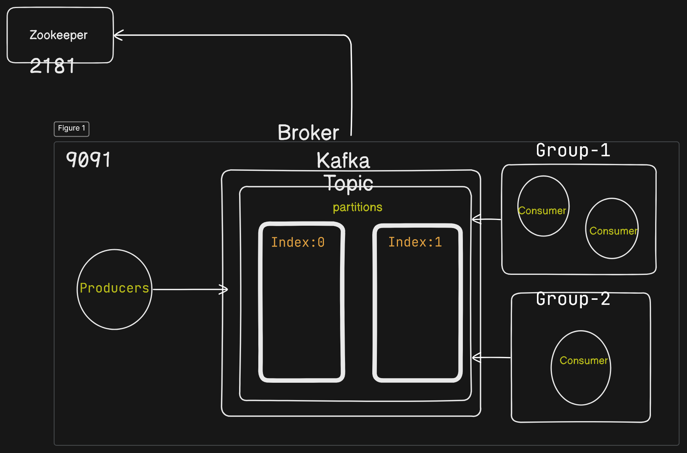
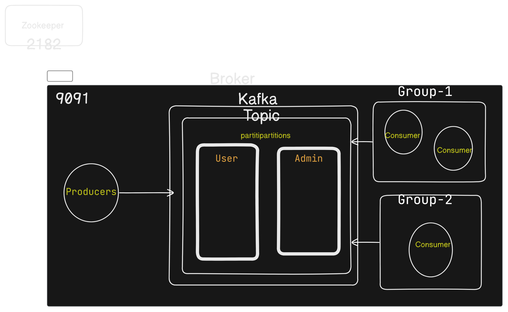

# A command line interface (CLI) with kafka
Apache Kafka is a popular open-source distributed evstreaming platform that enables users to build scalable, fault-tolerant, and high-performance data processing pipelines. It's often referred to as a "message broker" or "event streaming platform" and is widely used in real-time data processing, big data analytics, and microservices architecture. Kafka allows users to produce and consume data in real-time, making it an essential tool for building modern data pipelines, event-driven architectures, and cloud-native applications.  

# kafkajs
```
npm install kafkajs
```
Kafka.js is a JavaScript library for interacting with the Apache Kafka message broker. It provides a simple and intuitive way to produce and consume messages from Kafka topics. Kafka.js allows developers to send messages to Kafka topics, subscribe to topics and receive messages, and manage topic metadata.


# model : 





# Commands
Start Zookeper Container and expose PORT 2181.
```
docker run -p 2181:2181 zookeeper
```
Start Kafka Container, expose PORT 9092 and setup ENV variables.
```
docker run -p 9092:9092 \
-e KAFKA_ZOOKEEPER_CONNECT=<PRIVATE_IP>:2181 \
-e KAFKA_ADVERTISED_LISTENERS=PLAINTEXT://<PRIVATE_IP>:9092 \
-e KAFKA_OFFSETS_TOPIC_REPLICATION_FACTOR=1 \
confluentinc/cp-kafka
```

# Running Locally
Run Multiple Consumers
```
node consumer.js <GROUP_NAME>
```
Create Producer
```
node producer.js
```
>>user hiii
>> admin goodmorning

